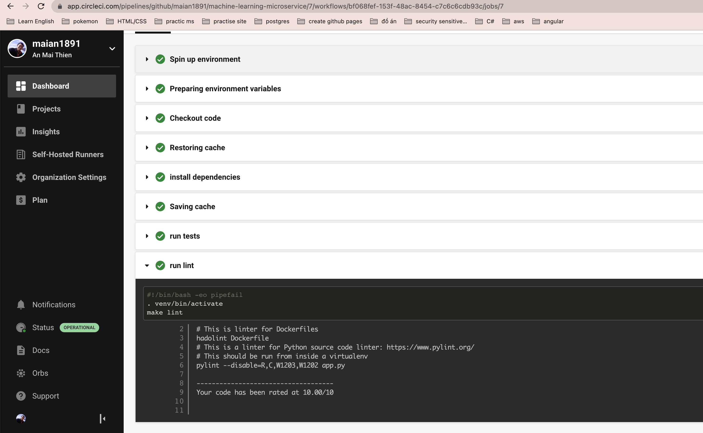

<include a CircleCI status badge, here>

## Prerequisites
These software must be installed in your machine
1. Docker desktop

## Run docker on local
1. Run run_docker.sh to build and run docker file
> ./run_docker.sh

## Push docker image to dockerhub
1. Change dockerpath in file upload_docker.sh
2. Export your docker hub username, password to system environment
> export DOCKER_USERNAME=<YOUR_USERNAME>
> export DOCKER_PASSWORD=<YOUR_PASSWORD>
3. Run upload_docker.sh to upload to dockerhub with your tag
> ./upload_docker.sh

### Kubernetes Steps
1. Change dockerpath in file run_kubernetes.sh
2. Run run_kubernetes.sh
> ./run_kubernetes.sh

## Link Docker Hub
https://hub.docker.com/repository/docker/maian1891/machine-learning-microservice

## CircleCI screenshot

